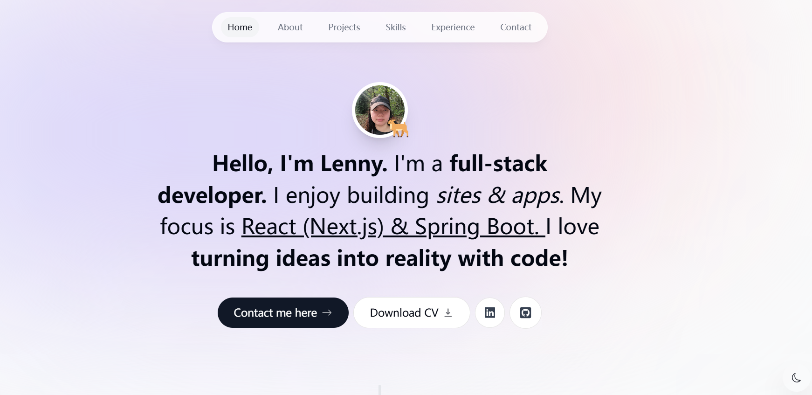
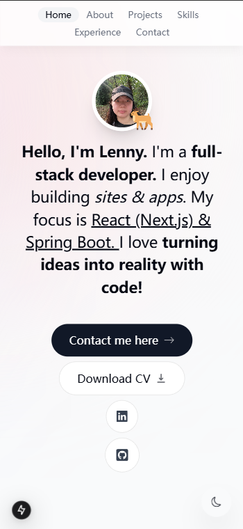
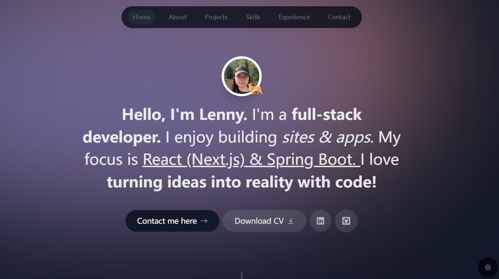
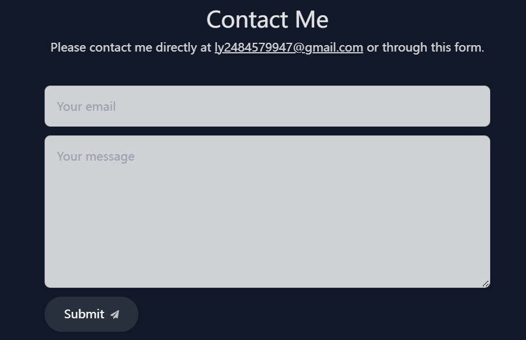

# Lenny's Portfolio

Welcome to [my portfolio](https://lenny-my-portfolio.vercel.app/)! I'm Lenny, a full-stack developer dedicated to creating innovative web experiences.

## Features

- **Responsive Design**: Optimized for desktops, tablets, and mobile devices.

- **Dark Mode**: Easily switch between light and dark themes for comfort.

- **Contact Form**: Reach out to me directly via email through the integrated contact feature.

## Technologies Used

- **Next.js**: For building server-rendered React applications.
- **Framer Motion**: For smooth animations and transitions.
- **TypeScript**: Enhancing the development experience with type safety.
- **Tailwind CSS**: For utility-first styling.
- **Email**: Integrated contact functionality.

## Live Demo

Explore my portfolio live at: [Lenny's Portfolio](https://lenny-my-portfolio.vercel.app/)

## Contact Me

Feel free to connect through the contact form on the website or reach out via [GitHub](https://github.com/LennyLee1998).

---

Thank you for visiting! I hope you enjoy exploring my work.
